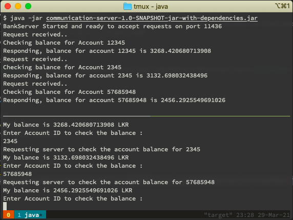

# [java-distributed-system]()

Distributed system using
- java
- gRPC
- maven
- zookeeper - Centralized server for distributed coordination of services
- etcd

## gRPC
### Generate Server Stub

- We generated server stub is the grpc code and we need grpc libraries to work for it. We need to import the dependent packages for gRPC using maven.
- maven will fetch the libraries which are under `<dependencies>` tag.
- Next, we need to generate the gRPC stub code, we can use the maven plugin or we can use the command line or make file too.
- `protoc` compiler can also generate the code too, so we can re-use that `BankService..proto` and generate the stubs for any language or platform.
- The stub code is platform dependent hence we incorporate the module into our code to fetch the os. We use the `os.maven-plugin`. The plugin would add this `os.detected.classifier` env variable after execution.
- We add a build extension which will be executed everytime we build the code. We use the `protobuf-maven-plugin` plugin to generate the stubs/grpc code during the build
- Build the code using command-line. This will generate the code
inside the target folder

```sh
> cd server
> mvn clean install
```

- After the grpc code is generated right click the `pom.xml` > maven > reload project to update the project for indexing.
- So we will have all the stubs created for us.
- We will then proceed to create the service classes in java. Right click the `main>java` and create a package called `ds.tutorials.communication.server`.
- Extend from the generated grpc code and change the implementation `BalanceServiceGrpc.BalanceServiceImplBase`. Then override the check balance method.
- We need to host this implementation as a server hence we need a `main` class.

- Next, we need to build an executable out of this meaning a `jar` archive file.
- We will use the `maven-assembly-plugin` to generate the fat jar or self-contained jar, which contains all the dependencies inside the jar itself. Because we need multiple dependencies.
- We need to give the main class or the entry point for our application to build the jar.

```xml
<mainClass>ds.tutorials.communication.server.BankServer</mainClass>
```

- Then build the project again
  
```sh
> cd server
> mvn clean install
```

- Then we can run the server using the generate jar file

```sh
> cd target
> ls -ltr
> java -jar communication-server-1-0-SNA
```

### Implementing a Client

- Create a new maven project, `file > new > project > maven > communication-client` inside client folder.
- Client can be in any other language.
- We will follow the same step using the interface definition and then we would generate the stubs, when it generates it will generate all the codes so the server code wont be used.
- So copy the `BankServices.proto` and add it into the client resources as well.
- Copy thr pom file dependecies from the server.
- `mvn clean install` the client pom file.

- We create a `CheckBalanceServiceClient` main class to just invoke our server function
check balance.

- Add the maven assembly package to client too to generate the jar
- Add `maven-assembly-plugin` to client’s pom.xml. Remember to change the mainClass configuration to match the fully qualified
name of your client’s main class

```xml
<mainClass>ds.tutorials.communication.client.CheckBalanceServiceClient</mainClass>
```

- Agan build the fat jar,

```sh
> cd client
> mvn clean install
```

- Start the client
  
```sh
> java -jar communication-client-1.0-SNAPSHOT-jar-with-dependencies.jar localhost 11436
```

### Final Output



## ZooKeeper
>  We will be build a distributed lock with apache zookeeper. 
- Zookeeper itself is a distributed server where we can connect to it and execute it.
- Replicated DB - will persist the state in memory.
- Request Processor - is only active in the master
- Atomic Broadcast - it will broadcast the changes to other nodes.
  
- A node in the system is represented by a location in zookeeper hierarchical namespace which is reffered as `znode`.
- `znode` keeps track of the data and the state changes of a given node.
- `znode` are organized into a hierarchical namespace.
- Ephemeral node:
- Ephemeral Sequential:
- Persistent node

- What we are trying to build is a distributed lock. This lock will allow two processes to access a shared resource with mutual exclusion.
- In order to communicate with ZooKeeper we need to create a client that makes use of
ZooKeeper client API.

- Just like we used gRPC client libraries to use grpc, we need to use zookeeper dependencies to use zookeeper api.
- Watchers are like observable that observes the changes that are happening to the znodes

## etcd


